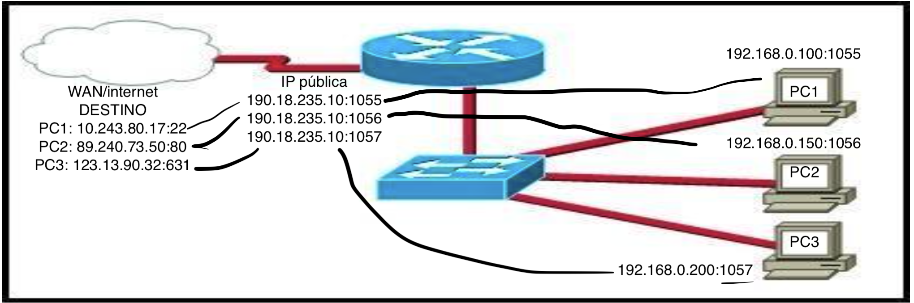

# Ejercicios Módulo 1, Unidad 3

## Buscar en Internet alguna noticia de un incidente (ataque) informático (no importa el tipo de técnica de ataque) y hacer un análisis personal de cómo PIENSAN que sucedió y cómo habría que evitarlo de acuerdo a sus puntos de vista o conocimientos (postear en el foro).

<https://www.redpacketsecurity.com/a-new-golang-trojan-chachi-used-in-attacks-against-us-schools/>

## Completar con direccionamiento y puertos, utilizando el protocolo PAT (subirlo al foro, no mandar por mail). Se solicita: IPs origen, IPs destino, puerto origen, puerto destino, de cada una de las PCs. Por otro lado, a nivel WAN, se pide una IP pública y el puerto identificador para cada servicio.



- IPs y puerto de origen

| pc | ip | puerto |
| --- | --- | ---- |
| 1 | 192.168.0.100 | 1055 |
| 2 | 192.168.0.150 | 1056 |
| 3 | 129.168.0.200 | 1057 |

- IPs y puerto de destino

| pc | ip | puerto |
| ---- | ----- | ---- |
| 1 | 10.243.80.17 | 22 |
| 1 | 89.240.73.50 | 80 |
| 1 | 123.13.90.32 | 631 |

- a nivel WAN, se pide una IP pública y el puerto identificador para cada servicio

| pc | ip | puerto |
| ---- | ----- | ---- |
| 1 | 190.18.235.10 | 1055 |
| 2 | 190.18.235.10 | 1056 |
| 3 | 190.18.235.10 | 1057 |

- Resumen

| pc | ip privada | puerto | | ip pública | puerto id | | ip destino | puerto |
| --- | --- | --- | --- | ---- | --- | --- | --- | --- |
| 1 | 192.168.0.100 | 1055 | --- | 190.18.235.10 | 1055 | --- | 10.243.80.17 | 22 |
| 2 | 192.168.0.150 | 1056 | --- | 190.18.235.10 | 1056 | --- | 89.240.73.50 | 80 |
| 3 | 192.168.0.200 | 1057 | --- | 190.18.235.10 | 1057 | --- | 123.13.90.32 | 631 |

## Utilizar y probar el comando “nslookup”, usar como guía el help del mismo comando. Buscar 3 direcciones IP y resolverlas a través del mismo comando.

```console
ARGMAC015:~ jose.aliaga$ nslookup resolvit.com
Server:         8.8.8.8
Address:        8.8.8.8#53

Non-authoritative answer:
Name:   resolvit.com
Address: 198.55.245.164

ARGMAC015:~ jose.aliaga$ nslookup office365.com
Server:         8.8.8.8
Address:        8.8.8.8#53

Non-authoritative answer:
Name:   office365.com
Address: 52.165.129.203
Name:   office365.com
Address: 13.90.213.204

ARGMAC015:~ jose.aliaga$

ARGMAC015:~ jose.aliaga$ nslookup mercadolibre.com.ar
Server:         8.8.8.8
Address:        8.8.8.8#53

Non-authoritative answer:
Name:   mercadolibre.com.ar
Address: 13.227.92.90
Name:   mercadolibre.com.ar
Address: 13.227.92.12
Name:   mercadolibre.com.ar
Address: 13.227.92.15
Name:   mercadolibre.com.ar
Address: 13.227.92.74

ARGMAC015:~ jose.aliaga$
```

## Explicar el proceso de DHCP en este dibujo, y especificar cómo sería el direccionamiento IP que ofrecería a los dispositivos (la máscara es 255.255.255.0 o podría ser la 255.255.0.0)

Dentro de una red hay un servidor DHCP con un rango de IPs privadas sin usar, con una submáscara de 255.255.0.0 y unas IPs que arrancan con 192.168.0.0/16. Este servidor DHCP tendrá disponible para otorgar 65.534 IPs privadas (<http://jodies.de/ipcalc?host=192.168.0.1&mask1=16&mask2=>).

- Cuadro 1: cuando entra un nuevo dispositivo a la red, envia paquete broadcast **DHCPDISCOVER** hasta que encuentra el servidor DHCP de la red.
- Cuadro 2: el servidor DHCP responde con un paquete unicast llamado **DHCPOFFER** _únicamente_ al dispositivo nuevo. En este DHCPOFFER se envía una IP tentativa.
- Cuadro 3: el nuevo dispositivo, que ya sabe dónde está el servidor DHCP, envía un paquete **DHCPREQUEST** que simboliza el pedido oficial de una dirección IP dentro del rango de IPs dispoibles.
- Cuadro 4: finalmente el servidor DHCP reserva la IP pactada y envía un paquete **DHCPACK** donse especifican las opciones de configuración además del tiempo que dura la reserva de la IP.

### AYUDA: hay un servicio que todavía no se enseñó que permitiría el uso de dos segmentos de red diferentes a través de un SW, ¿cuál es?

Creo que se refiere al servicio de subnetting, donde usamos segmentos lógicos para separar redes.

## De acuerdo a lo aprendido en las últimas 3 unidades, hacer un entregable, explicando cuáles podrían ser potenciales formas de mitigar los ataques en cada servicio o protocolo, por ejemplo, un ataque a un servidor DHCP. Especificar diciendo nombre del ataque y servicio o protocolo atacado. Al menos seleccionar 2 ataques de todo lo que vimos, relacionados con lo aprendido.

- Para prevenir el ataque DHCP STARVATION se podría implementar un firewall que controle las direcciones MAC de los dispositivos que envían DHCPDISCOVER para bloquearlas durante un cierto periodo de tiempo si envían más de X cantidad de paquetes broadcast. Consideraríamos este un comportamiento anómalo con malas intenciones. También podría ser un bug en algún programa del sistema operativo que causa un error en el cliente y también un error en la red, en este caso, en el servidor DHCP. En cualquier caso, la regla de firewall para hacer un drop a los paquetes que provengan de cierta dirección MAC solucionaría ambos escenarios.
- Para prevenir un ataque causado por un posible DHCP rogue server lo primero es conseguir detectar que un servidor DHCP que no es el "confiado" está entregando direcciones IP. Para esto existen distintos softwares (Rogue Checker, scapy) o IDS (sistema de detección de intrusos) que monitorean comportamientos anómalos en la red. Una vez detectado la existencia de un servidor DHCP rogue, se puede informar a los dispositivos que hagan un drop de los paquetes que reciban de este o directamente que el router haga ese drop de paquetes.


