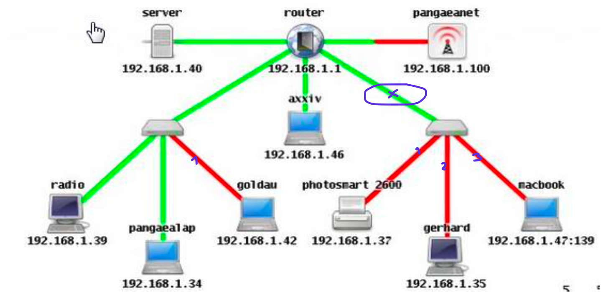
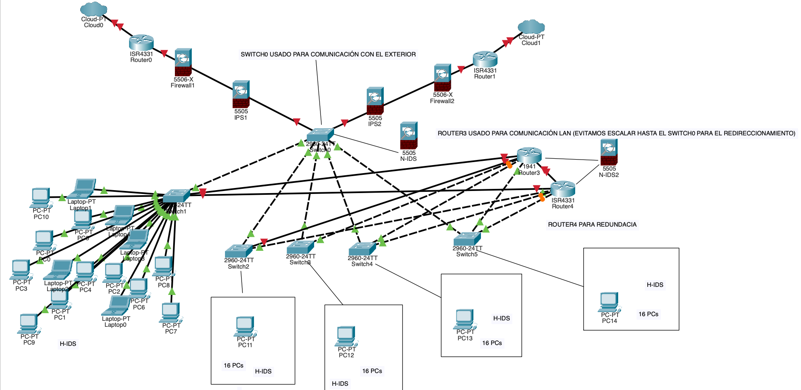

# Módulo 1 - Unidad 4

## Ejercicio 1

Siendo que el tráfico verde es interno (al servidor) y el rojo tiene salida al exterior, considero que es más importante proteger el tráfico orientado hacia el exterior. Ya que la red de la derecha tiene más dispositivos que usan la red roja/externa, pondría un firewall entre el router principal y el switch del conjunto derecho, como se indica en esta imagen:

## Ejercicio 2

- Escribir un ACL que permita el tráfico de la PC0 a la PC1: `access-list 101 permit ip host 10.20.20.50 0.0.0.0 host 10.10.10.51 0.0.0.0`
- y otro ACL que permita el tráfico de la PC0 al server: `access-list 101 permit ip host 10.20.20.50 0.0.0.0 host 10.10.10.50 0.0.0.0`
- Consigna: Logística y Ventas pueden verse entre sí, pero no pueden ver a Administración, sin embargo, Administración puede ver a todas
  - `access-list 101 permit ip 172.16.1.0 0.0.0.255 192.168.1.0 0.0.0.255` + `access-list 101 permit ip 192.168.1.0 0.0.0.255 172.16.1.0 0.0.0.255`
  - `access-list 1 permit IP host 10.10.10.0 0.0.0.255` o `access-list 101 permit ip 10.10.10.0 192.168.1.0 0.0.0.255` + `access-list 101 permit ip 10.10.10.0 172.16.1.0 0.0.0.255`

## De acuerdo a la metodología enseñada, poner en práctica los 6 puntos en este dibujo de red

1. Relevamiento: tenemos una red que consiste en un modem de acceso, que se conecta a un firewall (primera y única medida de seguridad de hardware) que después se conecta con un main switch. De este switch dependen _TODAS_ las conexiones con los dispositivos finales, desde impresores a WAP y distintos servidores. El main switch funciona también con enrutador. También observamos que existe (al menos) una conexión remota capaz de acceder a la red interna.
2. Idealmente, hay que proteger todo. Prioritariamente, habría que seleccionar los servidores, especialmente el servidor de BackUp. También proteger las computadores de los trabajadores ya que también hay está almacenada información confidencial. Al mismo tiempo, para las conexiones remotas, establecer medidas de control para asegurarnos de
3. Los dispositivos principales, que son los servidores NO están bien posicionados, ya que no existe un dispositivo intermedio entre ellos y el main switch. Si bien existe un firewall entre el modem y el main switch, sigue siendo un SPOF (single point of failure)
4. Agrega(r al menos un IPS después del firewall o detrás de otro switch entre el main switch y el grupo de servidores. También implementar un reglas al nivel del switch para permitir acceso de menor privilegio (least privilege access). Implementar un IDS en las subredes que se deberían crear, tanto en la subred de las estaciones de los usuarios finales como en la subred de los servidores.
5. Existe un solo servidor de backup. Si este falla, la red se quedaría sin respaldo. Se podría crear un servidor redundante de backup.
6. Cosas a mejorar podría ser implementar una VPN para el acceso remoto.

## Ejercicio final del módulo 1

Dada la estructura en el ejercicio añadí un firewall después de cada router además de un IPS después de cada firewall. Agregué dos routers (Router3 y 4) para la comunicación lateral, entre los dispositivos (doble router para asegurar redundancia). En los dispositivos agregué H-IDS. En el switch principal agregué un N-IDS al igual que otro N-IDS en los routers usamos para la comunicación lateral. Veo un SPOF que es el Switch0 - agregaría un segundo switch con las conexiones a los routers, aun sabiendo que eso significaría switches más grandes.
