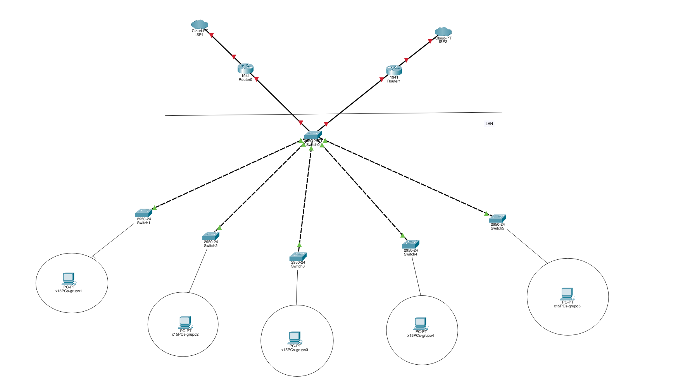
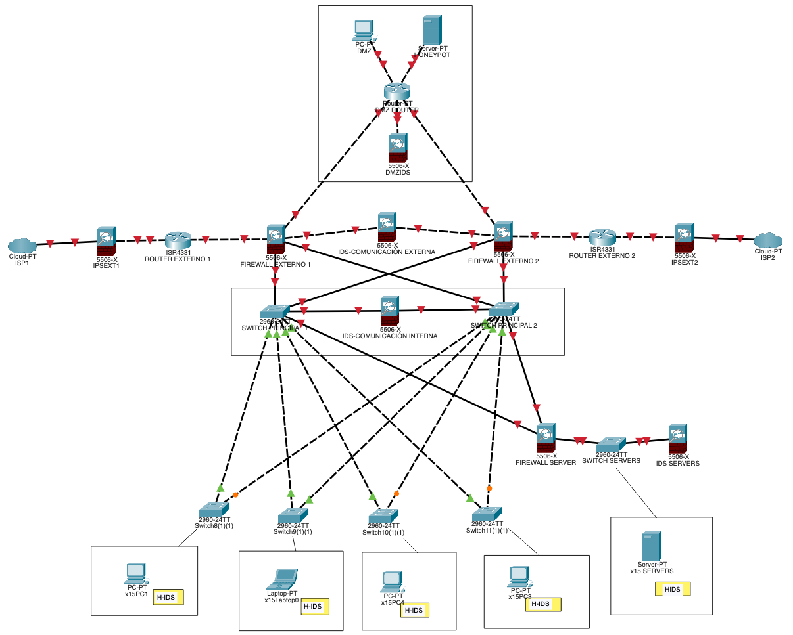

# Final unidad 1

Partimos de la base de que estamos armamndo una arquitectura de red para una oficina BASTANTE grande. El hecho de que tengan a disposición 5 switches nos indica que el presupuesto es alto. Tenemos que brindar servicio a un mínimo de 75 dispositivos. Este es un diagrama dado:

##  Problemas observados

- SPOF (Single Point Of Failure) en el Switch0: un ataque que afecte a este dispositivo haría que la comunicación tanto interna como externa fuera imposible.
- Falta de dispositivos de seguridad y control en toda la red

## Soluciones propuestas

- Para el SPOF del switch0, agregué un switch más - juntos estos dos switches forman los _switches princpales_.
- Seguridad:
  - Para monitorear todo el tráfico de la red y actuar de primera medida de salvaguarda, la conexión de los ISP pasan por un IPS (IPSEXT1 y 2).
  - Después de los routers externos, agregué un firewall (FIREWALL EXTERNO 1 y 2) que se conectan a:
    - un un router con una DMZ y un IDS para monitorear el tráfico en esta red en la frontera de la red
    - un IDS (IDS-COMUNICACIÓN EXTERNA) que controlará los paquetes que entren y salgan de la red
    - los **switches principales**
  - Para la seguridad interna agregué un IDS (IDS-COMUNICACIÓN INTERNA) entre los **switches principales** centrado en la comunicación de paquetes con origen en la red interna y destino la misma red
  - Agregué un firewall extra (FIREWALL SERVER) en la red interna con un IDS (IDS SERVERS) suponiendo que dentro de la red se encuentran los servidores más importantes (SWITCH SERVERS)
  - H-IDS: en los dispositivos agrgué una etiqueta que dice H-IDS para indicar que el administrador de los dispositivos tiene que asegurarse de que los mismos tienen un H-IDS instalado y actualizado

De esta manera creo que la red es segura y tiene suficiente redundancia como para soportar la falla en alguno de sus puntos.
