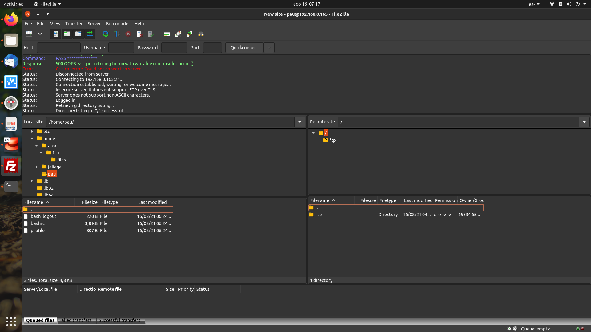

# Aliaga Unidad 3

## Ejercicio 1

## Ejercicio 2

Si fueras un DHCP, ¿qué datos mandarías a los siguientes dispositivos?

1. IP (YIADDR)
2. Máscara
3. Default Gateway
4. Dirección DNS
5. Identificador de clase del vendedor
6. Tiempo de reserva de la IP (en segundos)

## Ejercicio 3

Entiendo que lo que está ocurriendo es que un cliente está tratando de averiguar la dirección IP que corresponde a `www.google.com`. Al no tener esa entrada el servidor 2, este pregunta al servidor 3, al root server, que le indica dónde continuar la búsqueda. El servidor lo mismo, hasta que finalmente llega al servidor 5, que tiene la información y finalmente se la provee al cliente.
