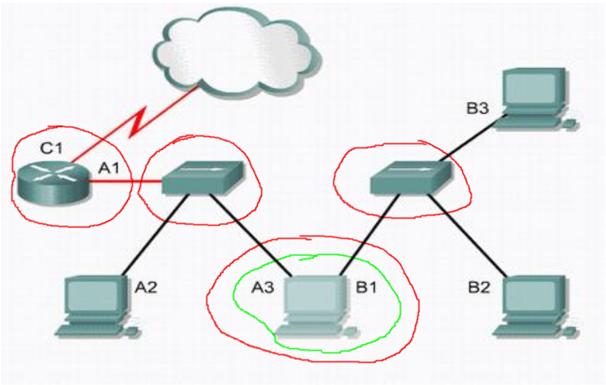

# Aliaga Unidad 3

## Ejercicio 1

Todos los puntos únicos de falla, tales como el único router, los switches. Para la consigna el dispositivo cliente A3/B1 (marcado en verde) es un dispositivo clave para la comunicación no solo de A2, si no para garantizar la comunicación entre ambas redes.

## Ejercicio 2

1. Phishing: un correo electrónico que intenta que visitemos una URL para que pongamos nuestros datos veridicos, que descarguemos un archivo y lo abramos. Puede ser un un phising:
  1. Spear phishing: un correo electrónico personalizado para la victima.
  2. Bulk phishing: a través de listas de correo electrónico, se manda un único mail a todas ellas con la esperanza de que alguien "pique".
2. BEC (Business Email Compromise): forma especial de phishing donde el atacante manda correos como si fueran una empresa (netflix, spotify, personal...).
3. Email Spoofing: el correo que recibimos de un atacante parece legítimo al cambiar los headers del email.
4. imitación de dominio: un email que parece que viene de una cuenta legítima, pero tiene algún caracter diferente (`amazOn` o `4pple`).

## extra

1. `¿Cuál piensan que es el objetivo principal de estos comandos?` Automatizar tareas, hacer que la administración del sistema sea más rápido.
2. `¿Si tuvieran la oportunidad de crear un nuevo comando de red, que te gustaría que haga?` Que muestre mi dirección de ip pública.

