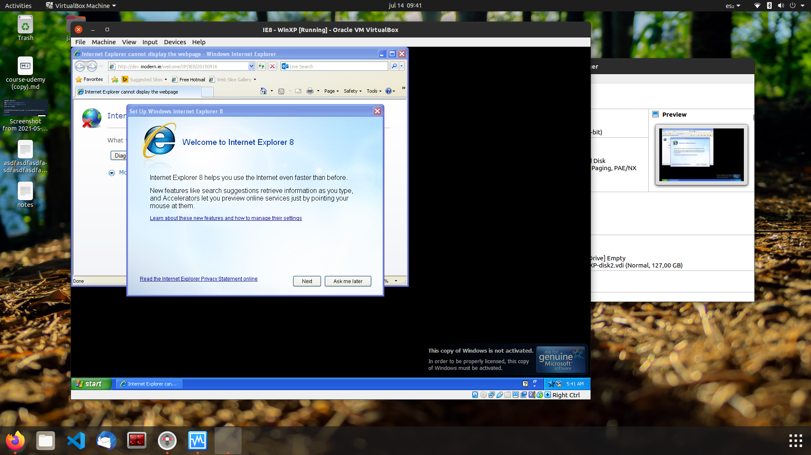

# Módulo 2 - Unidad 1

## Ejercicio 1

## Contestar el siguiente múltiple choice y subir las respuestas al foro, justificando la respuesta (varias pueden ser correctas).

1. Qué modelo de despliegue podríamos aplicar, si un cliente requiere que los datos sean compartidos con otra empresa

- [ ] A PÚBLICO 
- [ ] B PRIVADO
- [x] C COMUNIDAD
- [ ] D HÍBRIDO

2. ¿Que habría que realizar para segurizar una red? (una o más son correctas) 

- [x] A Utilizar un firewall
- [x] B Cumplir con la parte legal (entiendo que esto no tiene mucho que ver con la parte técnica, si no con proveer capacitación para los trabajadores sobre buenas prácticas de ciberseguridad)
- [x] C Crear listas de acceso
- [x] D Insertar seguridad física

3. ¿De los pasos de segurizar la red, cuál es el que tenemos que definir el activo para cada recurso? (contestar a criterio propio)

- [ ] A Identificar los componentes
- [ ] B Efectuar el análisis de riesgo
- [x] C Identificar los tipos de controles
- [ ] D Relacionar tipo de solución con la zona de riesgo
- [ ] E Relacionar soluciones de mercado con tipo de control
- [ ] F Diseño final de la red

4. Utilizar un servicio en la nube, que característica positiva encuentro:

- [ ] A Tengo todos los servicios - no todos los cloud providers tienen los mismos servicios
- [ ] B Dispongo de una sala de servidores para mi empresa
- [x] C Servicio medible y tarifable
- [ ] D No dispongo de acceso global

5. Cuál es la organización dedicada a brindar las mejores soluciones de seguridad para el Cloud Computing??

- [ ] A Google 
- [ ] B Amazon
- [ ] C NSA
- [x] D CSA
- [ ] E Sittus
