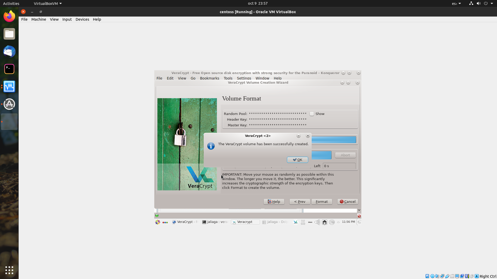

# Módulo 4 - Unidad 1

## Ejercicio 1

### seleccionar 1 técnica de ataque y hacer una breve descripción de la misma, por ejemplo detallar de qué se trata la técnica de Phishing, no se pide realizar la técnica, únicamente explicar que entienden por la misma.

Técnica seleccionada: Spoofing.

En el campo de la ciberseguridad, spoofing es la práctica de pretender ser alguien más para ganar nuestra confianza y así lograr objetivos maliciosos, ya sea robar plata, documentos, encriptar equipos de trabajo o simplemente chantajear al sujeto de dicho ataque.

Existen diversos tipos de técnicas de spoofing:

- spoofing via correo electrónico: el atacante envía un correo electrónico que simula ser verídico (de un banco, aplicación o sitio web muy conocido) para dirigir a la víctima a una página web que parece original, pero no lo es.
- spoofing de sitio web: el atacante crea una página web similar a la página web original pero que está hosteada en un servidor propio para que el usuario use sus credenciales en la web ficticia.
- spoofing via llamado telefónico: a través de información adquirida en la red, el atacante se hace pasar por un proveedor de servicio del usuario e intenta obtener información de su cuenta.
- Man-in-the-middle: el atacante crea una red wi-fi fraudulenta para que las personas que se conectan a la red sean redirigidas a páginas fraudulentas o propias del atacante para así obtener información.
- spoofing the IP: usado en ataques DDoS, esta técnica evita que el tráfico malicioso sea eliminado y oculta la IP pública verdadera del atacante.

Fuentes:

- <https://www.jigsawacademy.com/blogs/cyber-security/spoofing/>
- <https://www.javatpoint.com/dns-spoofing>

## Ejercicio 2

### Mediante una máquina virtual, hacer uso de estas 2 herramientas, cifrando un directorio personal y realizando un cifrado de un archivo (ambos resultados, subirlos al foro exponiendo la captura imagen)

Veracrypt:

gpg4win

